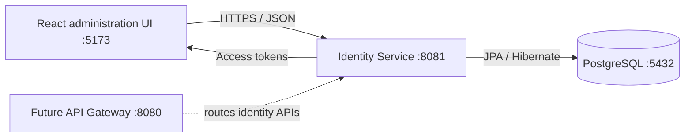

# MySociety Identity Service

The first bounded service in the MySociety platform. It provides authentication, JWT access tokens, refresh-token
rotation, user administration, role assignments, and an accompanying React administration UI.

## Architecture



The service exclusively owns the identity tables in the `mysociety` schema:
`app_users`, `roles`, `permissions`, `role_permissions`,
`user_society_roles`, `refresh_tokens`, `audit_events`, and `outbox_events`. No other business-domain table is mapped by
this service.

## Technology stack

| Area                  | Technology |
|-----------------------|---|
| Language and build    | Java 21, Gradle (Groovy DSL) |
| API                   | Spring Boot 3, Spring Web, Bean Validation, Springdoc OpenAPI |
| Security              | Spring Security `SecurityFilterChain`, OAuth2 JOSE JWT, BCrypt |
| Persistence           | Spring Data JPA, Hibernate, PostgreSQL |
| Operations            | Spring Boot Actuator |
| Backend quality       | JUnit 5, Mockito, AssertJ, MockMvc, Testcontainers PostgreSQL, ArchUnit |
| Web application       | React, TypeScript, Vite, React Router, Material UI |
| Client data and forms | Axios, TanStack Query, React Hook Form, Zod, Zustand |
| Frontend quality      | Vitest, React Testing Library, ESLint, Prettier |

`docs/architecture.md` describes the current service boundary and planned
platform expansion. `docs/service-requirements.md` is the complete
service-by-service target-state requirements catalogue. The code deliberately
uses Spring Boot 3.x—not Boot 4—and modern Spring Security configuration,
never `WebSecurityConfigurerAdapter`.

## Run locally

Prerequisites: Java 21, PostgreSQL with the existing `mysociety` database/schema, and Node.js 20+.

```powershell
# Backend
.\gradlew.bat clean test
.\gradlew.bat bootRun --args="--spring.profiles.active=dev"

# Frontend (a second terminal)
Set-Location frontend\mysociety-web
npm install
npm run dev
```

The backend listens on `http://localhost:8081/api/v1`; its OpenAPI UI is at
`http://localhost:8081/api/v1/swagger-ui/index.html` and health is at
`http://localhost:8081/api/v1/actuator/health`. The frontend is available at
`http://localhost:5173`.

Set `VITE_API_BASE_URL=http://localhost:8080/api/v1` when a future API Gateway is introduced; client API modules require
no source changes.

## Security configuration

Configure production database credentials and `IDENTITY_JWT_SECRET` through environment variables. The signing secret
must be at least 32 bytes, unique per environment, and never committed. The local profile may provide only a
development-only default. Password hashes, access tokens, and refresh tokens are never returned from administrative APIs
or logged.
