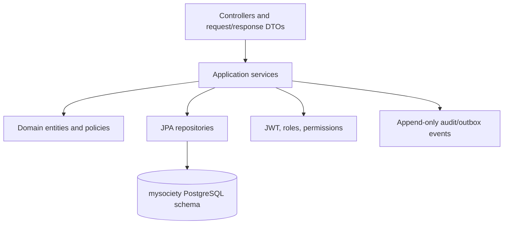

# Identity Service Architecture

## Current scope

This repository implements the platform's Identity Service and its React authentication/user-administration frontend. It
intentionally does not implement finance, billing, operations, visitor, facility, notification, or reporting domains.

The API boundary is `http://localhost:8081/api/v1`. The browser communicates directly with it during local development;
a future API Gateway will own cross-service routing and expose the same `/api/v1` resource paths.

## Backend layers

Controllers only perform HTTP concerns and validation. Application services orchestrate authentication, token lifecycle,
invitation, account-status, and role-assignment workflows. Entities map the existing database; Hibernate schema
validation is enabled and this service never creates, updates, or drops schema.

## Security model

Successful authentication produces a short-lived signed JWT access token and a rotating opaque refresh token. Refresh
tokens are stored only as hashes. JWT claims include the authenticated user and granted permissions so Spring Security
can enforce endpoint authorities. Passwords are BCrypt hashes and are never logged or serialized.

Users are scoped to societies through `user_society_roles`. A request that manages users or assignments requires a
user-management permission and society context. Audit events record authentication and administration outcomes; the
database trigger makes them immutable.

## Planned platform integration

The future platform uses an API Gateway (:8080), then independently deployable Society, Finance, Operations, Community,
Communication, and Reporting & Audit services. PostgreSQL table ownership remains exclusive to each service. Kafka,
Redis, Spring Cloud Gateway, Resilience4j, Micrometer, and OpenTelemetry are platform-level additions; they are
intentionally not runtime dependencies of this standalone Identity Service.

## Technology decisions

- **Java 21 and Spring Boot 3:** supported LTS JVM and modern Spring Security.
- **PostgreSQL + JPA/Hibernate:** matches the supplied relational schema and optimistic-locking/version columns.
- **OAuth2 JOSE JWT:** native Spring Security JWT encoder/decoder support, avoiding deprecated security APIs.
- **React + TypeScript + Vite:** fast, typed administration interface.
- **TanStack Query, Axios, Zustand:** server-state, HTTP, and ephemeral authenticated-session concerns remain separate.
- **React Hook Form + Zod:** typed form validation before requests.
- **Actuator + OpenAPI:** health and contract discoverability.
- **JUnit/MockMvc/ArchUnit/Testcontainers and Vitest/RTL:** layered automated verification for backend and frontend.
