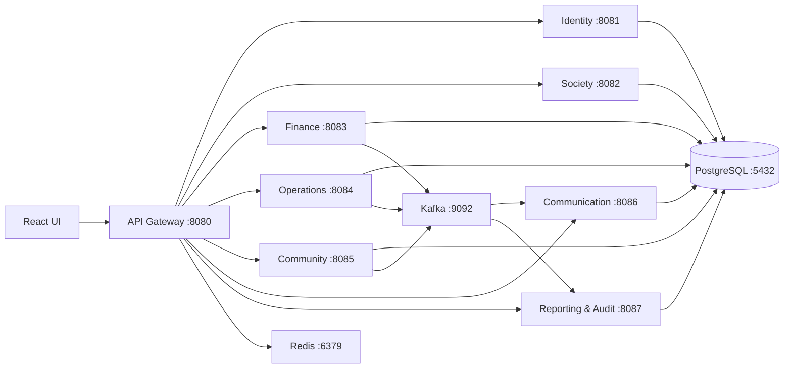

# MySociety Service Requirements

This catalogue consolidates the architecture and delivery requirements from the
[shared design conversation](https://chatgpt.com/share/6aaf83aa-96a8-83ee-8390-887b2f9243bd).
It is a target-state specification: only the Identity Service and its web
module are implemented in this repository. All other services below are planned
and must be developed as independent deployables that own their data.

## Platform topology and local ports

## Service directory

| # | Service | Local port | Repository | Delivery status |
|---:|---|---:|---|---|
| 1 | API Gateway | 8080 | [`kknunna18/mysociety-api-gateway-service`](https://github.com/kknunna18/mysociety-api-gateway-service) | Implemented on the `kknunna18-api-gateway-implementation` branch |
| 2 | Identity Service | 8081 | [`kknunna18/mysociety-identity-service`](https://github.com/kknunna18/mysociety-identity-service) | Implemented on the `backend-identity-service` branch |
| 3 | Society Service | 8082 | [`kknunna18/mysociety-society-service`](https://github.com/kknunna18/mysociety-society-service) | Implemented on the `kknunna18-society-service-implementation` branch |
| 4 | Finance Service | 8083 | Not created | Planned |
| 5 | Operations Service | 8084 | Not created | Planned |
| 6 | Community Service | 8085 | Not created | Planned |
| 7 | Communication Service | 8086 | Not created | Planned |
| 8 | Reporting & Audit Service | 8087 | Not created | Planned |

PostgreSQL, Kafka, and Redis use ports `5432`, `9092`, and `6379`,
respectively. Each service remains independently deployable and owns only its
listed tables.

## Service requirements

### API Gateway

- Route `/api/v1/auth/**` and `/api/v1/users/**` to Identity; route
  `/api/v1/societies/**`, `/api/v1/buildings/**`, `/api/v1/units/**`, and
  `/api/v1/residents/**` to Society.
- Validate JWTs at the edge and require downstream services to validate them
  too.
- Configure CORS, correlation IDs, standard RFC 9457 error responses, safe
  request/response logging, Redis-backed rate limiting, and circuit breakers.
- Use Spring Cloud Gateway, OpenFeign where service clients are needed, and
  Resilience4j via Spring Cloud Circuit Breaker.

### Identity Service

**Owned tables:** `app_users`, `roles`, `permissions`, `role_permissions`,
`user_society_roles`, and `refresh_tokens`. It writes authentication audit and
outbox records but no other domain's data.

- Authenticate users; issue short-lived JWT access tokens and rotate opaque
  refresh tokens.
- Support logout, password management, invitations, account status, roles,
  permissions, and society-role assignments.
- Produce authentication audit events and use the transactional outbox pattern
  for important identity events.
- Required API surface:
    - `POST /api/v1/auth/login`, `/refresh`, `/logout`, `/forgot-password`,
    `/reset-password`, and `/select-society`
    - `GET /api/v1/auth/me`
    - `POST /api/v1/users/invitations`
    - `GET /api/v1/users` and `/api/v1/users/{userId}`
    - `PATCH /api/v1/users/{userId}/status`
    - `GET /api/v1/roles`
    - `POST /api/v1/users/{userId}/roles`
    - `DELETE /api/v1/users/{userId}/roles/{roleId}`
- The current implementation covers login, refresh, logout, `me`, invitations,
  user listing/detail/status, role listing, and role assignment/revocation.
  Password-reset and society-selection flows remain planned work.

### Society Service

**Owned tables:** `societies`, `buildings`, `units`, `household_memberships`,
`vehicles`, and `society_settings`.

- Administer societies, buildings, and units.
- Manage resident/household memberships and vehicles.
- Manage per-society settings.
- Publish membership-related Kafka events for downstream consumers.

### Finance Service

**Owned tables:** `charge_heads`, `billing_runs`, `invoices`, `invoice_lines`,
`invoice_adjustments`, `payment_attempts`, `payment_events`,
`payment_allocations`, and `receipts`.

- Manage charge heads, billing runs, invoices, invoice lines, and adjustments.
- Accept provider payment webhooks safely; enforce idempotency.
- Allocate payments, generate receipts, reconcile payment state, and handle
  refunds.
- Use `BigDecimal` for monetary values, idempotency keys for financial
  commands, and event publication for invoice and payment changes.

### Operations Service

**Owned tables:** `complaints`, `complaint_comments`,
`complaint_status_history`, and `work_orders`.

- Create and track complaints with comments and status history.
- Create work orders, assign work, calculate SLAs, and escalate breaches.
- Record resolution and collect feedback.
- Publish complaint and work-order events for communication and reporting.

### Community Service

**Owned tables:** `visitor_approvals`, `visitor_entries`, `facilities`, and
`facility_bookings`.

- Approve visitors and record visitor check-in/check-out.
- Administer facilities and determine availability.
- Create facility bookings and prevent overlapping booking conflicts.
- Publish visitor and booking events.

### Communication Service

**Owned tables:** `notices`, `notice_audiences`, `documents`,
`entity_attachments`, `notification_templates`, and `notifications`.

- Publish notices and documents to defined audiences.
- Send in-app, email, SMS, and push-ready notifications through a channel
  abstraction.
- Consume platform Kafka events and convert them into notifications.

### Reporting & Audit Service

**Owned data:** reporting projections, `export_requests`, and its audit-event
storage/read model.

- Consume Kafka events to build dashboard/reporting projections.
- Serve reports and asynchronous export requests.
- Store and query audit events as an append-only audit read model.

## Cross-service requirements

### Data and tenancy

- The PostgreSQL database/schema is `mysociety`; use
  `ddl-auto=validate` and `hibernate.default_schema=mysociety`. Never use
  `create`, `create-drop`, or `update`.
- A service may access only its owned tables. Do not share JPA entities,
  repositories, or a common repository library.
- Use UUID identifiers; optimistic locking (`@Version`) where the table has a
  version column; `Instant` or `OffsetDateTime` for timestamps.
- Every tenant operation requires validated society context containing user,
  society, roles, permissions, and correlation ID. Never trust a society ID
  supplied only in a request body.
- Tenant-owned repository queries, cache keys, events, and logs must include
  society context. Add negative isolation tests proving cross-society access is
  rejected.

### API, security, and events

- All APIs use `/api/v1`, REST conventions, validation, pagination, sorting,
  filtering, proper status codes, OpenAPI, and RFC 9457 `ProblemDetail` errors.
- Never expose JPA entities, password hashes, refresh tokens, stack traces,
  database details, or secrets.
- JWT claims must include `sub`, `userId`, `societyId`, roles, permissions,
  `iat`, `exp`, and `jti`. Use method-level authorization.
- Kafka uses KRaft mode, versioned envelopes (`eventId`, type/version,
  timestamp, society, aggregate, correlation ID, and payload), transactional
  outbox publication, idempotent consumers, and dead-letter topic conventions.
- Redis supports gateway rate limiting, short-lived session/auth controls,
  read caching, and idempotency acceleration; PostgreSQL remains the system of
  record.

### Observability and quality

- Provide Actuator health, readiness, liveness, structured logs, correlation
  propagation, Micrometer metrics, OpenTelemetry-ready tracing, and
  Prometheus-compatible metrics.
- Never log passwords, JWTs, refresh tokens, payment secrets, or complete
  sensitive webhook payloads.
- Require unit, repository-integration, controller, security, tenant-isolation,
  validation, and failure-path tests. Use JUnit 5, Mockito, AssertJ, Spring
  Boot Test, Testcontainers, MockMvc/WebTestClient, and ArchUnit.

## Required platform technology

Java 21, Spring Boot 3.x, compatible Spring Cloud BOMs, Spring Security,
Spring Cloud Gateway, OpenFeign, Resilience4j, Spring Cloud Stream, Kafka,
Hibernate/JPA, PostgreSQL, Redis, Gradle Groovy DSL, Docker Compose, JWT,
OpenAPI, Micrometer, OpenTelemetry, Testcontainers, MapStruct, and limited
Lombok. Do not use Spring Boot 4 or mix incompatible manually-versioned Spring
dependencies.

## Delivery sequence

1. **Platform foundation:** Gradle multi-project structure; shared web,
   security, event, observability, and test libraries; Docker Compose for
   PostgreSQL/Kafka KRaft/Redis; API Gateway, Identity, and Society skeletons;
   local profile configuration; health/OpenAPI; architecture documentation.
2. **Identity completion:** complete the remaining password reset and society
   selection workflows, then add comprehensive PostgreSQL Testcontainers,
   tenant-isolation, and security-path coverage.
3. **Society, Finance, Operations, Community:** implement each bounded
   service in that order, preserving exclusive data ownership and event
   contracts.
4. **Communication and Reporting & Audit:** consume domain events, deliver
   notifications, and construct reporting/audit projections.
